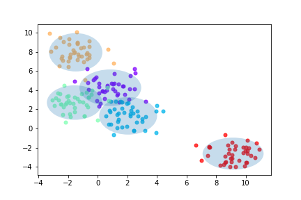
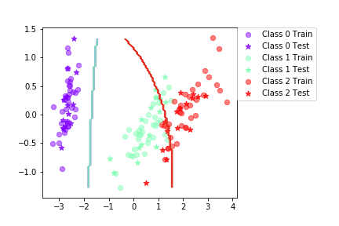
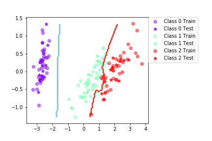
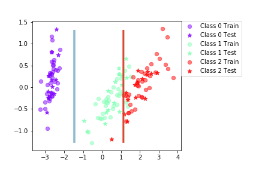
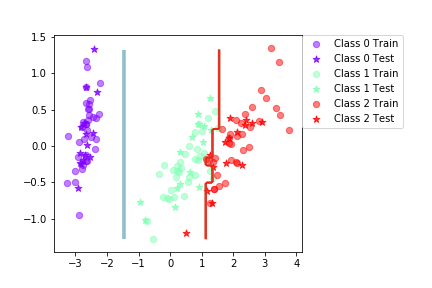

# Bayes classifier and Boosting

## Assignment 1:
>## Test the Maximum Likelihood estimates
> Call `genBlobs` and `plotGaussian` to verify your estimates.
* `genBlobs` generates test data, it returns Gaussian distributed data points together with class labels.
* `plotGaussian` computes the ML estimates for the data and plot the 95%-confidence interval.

This is an example of a Bayesian classifier where the data of each class is multivariate Gaussian: 

## Assignment 2:

## Assignment 3:
> Call the `testClassifier` and `plotBoundary` functions for this part.
## Iris:

`Final mean classification accuracy  89 with standard deviation 4.16`

> When can a feature independence assumption be reasonable and when not?

The naive Bayes Classifier is based on the assumption that all the feature dimensions are uncorrelated. 
In reality this assumption doesn't always hold true, as features tend to be dependent. For that reason "Naive",
as we still assume they are independent. 
Therefore, it would be more reasonable when dealing with features such as a person's height and eye color, 
as we can assume their values are independent. On the other hand for datasets such as `iris`, the 2 attributes 
(length and width) that describes the characteristics (sepal, petal) of the iris (Setosa, Versicolour, Viriginica) 
show to be positively correlated. On the contrary, datasets such as `wine`show the feautures to be uncorrelated, therefore
the classification accuracy is better, as the independence assumption holds true. 
`Final mean classification accuracy  97.6 with standard deviation 1.85`

> How does the decision boundary look for the `iris` dataset? How could one improve the classification 
results for this scenario by changing classifier or, alternatively, manipulating the data?

For the instances belonging to the first class the decission boundry is well defined as it properly separates
instances from the first and second class, although for the second and third class we can see there are misclassifications
on both directions, which denotes a flaw of the weack classifier, consequence of the features dependency.
We could try rotating the data, although this might not work in all cases.

>## Boosting functions to implement
>The implemented functions can now be summarized another classifer,
the `BoostClassifier` class. This class enables boosting different types of classifiers by initializing 
it with the `base_classifier` argument. 
> ## Run some experiments
> Call the `testClassifier` and `plotBoundary` functions for this part.

## Iris:

`Final mean classification accuracy  94.7 with standard deviation 2.82`

## Assignment 5: Boosting Using Bayes classifier.

> Is there any improvement in classication accuracy? Why/why not?

* **Iris**: Naive Bayes classifier `Final mean classification accuracy  89 with standard deviation 4.16` & Naive Bayesian classifier with adaboost algorithm `Final mean classification accuracy  94.7 with standard deviation 2.82`
* **Vowel**: Naive Bayes classifier `Final mean classification accuracy  64.7 with standard deviation 4.03` & Naive Bayesian classifier with adaboost algorithm `Final mean classification accuracy  80.2 with standard deviation 3.52`
* **Wines**: Naive Bayes classifier  `Final mean classification accuracy  97.6 with standard deviation 1.85` & Naive Bayesian classifier with adaboost algorithm: `Final mean classification accuracy  96.6 with standard deviation 1.98`

For the `iris` and `vowel` datasets there is indeed an improvement, as the classification accuracy improves with the adaboost algorithm 
applied to the implemented classifier. The idea of boosting is to generate a set of weak learners that can create a strong learner, where
a weak learner is just a learner that classifies instances better than if it was a random guess, therefore is slightly correlated 
with the true classification.
Boosting is an ensemble method that works with high bias classifiers, therefore in the case of the `iris` data set it helps to resolve
the dependency effect of the features and increase the accuracy of the classifier. In the case of the `wine` data set as the features 
show already to not be correlated the Naive Bayes classifier has already a good classification accuracy, therefore the boosted version
of it don't make it better and it can actually reduce the accuracy (which is the case). 

For both datasets  `iris` and `vowel` there is  an improvement of, bias and variance reduction.

> Plot the decision boundary of the boosted classifier on iris and compare it with that of the basic. What differences do you notice? Is the boundary of the boosted version more complex?

For the `iris` dataset the boundry is now more complex and classifies more efficiently the instances, there are still some  misclassifications but not as many as in the Naive Bayes Classifier. This also depends on how many iteration rounds we perform. As in each round the weights are updating according to the current classification errors leading the next invocation of the learning  algorithm to focus more on this incorrect classifications. We could perform cross validation to decide a good number for the iterarions.

> Can we make up for not using a more advanced model in the basic classifier (e.g. independent features) by using boosting?

Yes, boosting can help us to improve simple classifiers, mostly when the independence assumption do not hold true, which in reality is in most of the cases. In any case, the boosting method idea is to work with simple models, so it won't show a better performance with a more advanced model on the basic classifier, this could be the case of the `wine` dataset as a more advanced model will probably have a low bias, and if it was the case to have a high variance, we could instead apply the bootstrap aggregation method but boosting won't  really make a big change.

## Now repeat the steps with a decision tree classifier.
## Iris:

`Final mean classification accuracy  92.4 with standard deviation 3.71`

## Assignment 6: Boosting Using Decission tree classifier.

## Iris:

`Final mean classification accuracy  94.6 with standard deviation 3.67`

> Is there any improvement in classication accuracy? Why/why not?

## Using Bayes Classifier:
* **Iris**: Naive Bayes classifier `Final mean classification accuracy  89 with standard deviation 4.16` & Naive Bayesian classifier with adaboost algorithm `Final mean classification accuracy  94.7 with standard deviation 2.82`
* **Vowel**: Naive Bayes classifier `Final mean classification accuracy  64.7 with standard deviation 4.03` & Naive Bayesian classifier with adaboost algorithm `Final mean classification accuracy  80.2 with standard deviation 3.52`
* **Wines**: Naive Bayes classifier  `Final mean classification accuracy  97.6 with standard deviation 1.85` & Naive Bayesian classifier with adaboost algorithm: `Final mean classification accuracy  96.6 with standard deviation 1.98`

## Using Decission Trees Classifier:
* **Iris**: DT classifier `Final mean classification accuracy  92.4 with standard deviation 3.71`  & DT classifier with adaboost algorithm `Final mean classification accuracy  94.6 with standard deviation 3.67`.
* **Vowel**: DT classifier `Final mean classification accuracy  64.1 with standard deviation 4`  & DT classifier with adaboost algorithm `Final mean classification accuracy  86.7 with standard deviation 2.87`
* **Wines**: DT classifier `Final mean classification accuracy  91.1 with standard deviation 4.22`   & DT classifier with adaboost algorithm `Final mean classification accuracy  92 with standard deviation 3.78` 

According to the decission tree class in `labfun` The basic decission tree classifier depth will be half of the number of features plus one, meaning that it won't be the full tree, in the case of the boosted version all the weak learining classifiers will be grown one level, thus the weak models will have a high bias, trees tend to overfit the data and also tend to have low bias. Although unlike the Bayes classifier, it doesn't assume feature independence, therefore is not sensitive to it. Given the different data sets the classification accuracy improved in all of the cases although, just on the `vowels` data set  it outperformed the bayes classifier. 

> Plot the decision boundary of the boosted classifier on iris and compare it with that of the basic. What differences do you notice?  Is the boundary of the boosted version more complex?

for the Iris data set the decission boundry is indeed more complex (has more steps? edgy?) and classifies better the data. It is almost as good as the boosted version of the bayesian classifier method.

> Can we make up for not using a more advanced model in the basic classifier (e.g. independent features) by using boosting? Same as before.

## Assignment 7: 
1. If you had to pick a classiffer, naive Bayes or a decision tree or the boosted versions of these, which one would you pick? Motivate from the following criteria:

This merely depends on the data we are working with, so there's not an only answerÑ

**Outliers**: The best classification method will be **Tree classifier** ans it's less sensitive to outliers.
* Naive Bayesian classifier: I'ts very sensitive to outliers, it can make the boundry change.
* Boosted Naive Bayessian classifier and Boosted tree classifier: as the boosting functionality is to assign a greater weight to missclassified instances, this makes the method very sensitive to outliers, disregarding the classification method used.

**Irrelevant inputs: part of the feature space is irrelevant:** The best classification method will be **Tree classifier** as as the tree will only take into account those features that maximize the information gain, which is not the case of irrelevant features.

Although for **Naive Bayesian classifiers**, irrelevant inputs could help meeting the independence assumption, these are features that are irrelevant and won't improve our classification, removing these features won't make things change, it's just noise, although addind these  could make the Naive Bayes classifier perform better. If most of our features are dependent adding noise can actually help us to make these features less dependent . Still, adding too much noise will make the variance increase and put relevant fetures behind.

* **Boosted Bayesian classifier:**
* **Boosted tree classifier:** 

**Predictive power:** The best classification method will be the **Boosted Bayesian classifier** which classifies the instances according to the max posteriori probability, taking into account the evidence and prior probabilities, it makes accurate predictions, furthermore the fact that the method is error oriented makes it more sensitive to misclassifications.
* **Naive Bayesian classifier:** It has a good predictive power when the independency assumption is met.
* **Tree classifier:** The classification will depend on the values the attributes that minimizes the entropy. (in this case the split criteria is the gini index). Normally decission trees tend to overfit the data (bagging is a good solution for reducing variance) meaning that it has a  good predictive power on the trainning data but not necessarily on out of sample data, as its predictions are done mapping the tree acoordind to the instance predictors.
* **Boosted tree classifier:** similarly to the Boosted Bayesian classifier, the boosted tree classifier outperforms in predictive power to the basic tree classifier, as it penalize misclassifications with a greater weight. Aiming to achieve a bias reduction.

**Mixed types of data: binary, categorical or continuous features, etc.** **Tree classifiers** perfoms well with both, categorical or continous data. (binary is just a special case of categorical).
* **Naive Bayesian classifier:** Will work better with continous variables.
* Boosted Naive Bayessian classifier: It won't improve the Naive Classifier.
* Boosted tree classifier:

**Scalability: the dimension of the data, D, is large or the number of instances, N, is large, or both.**
* **Naive Bayesian classifier and **Boosted Naive Bayessian classifier:** As the classifier's predictions are made using the prior probability, the boosted and Naive Bayessian classifier works well with small samples, and high dimensions.The method is relatively simple is not computationally expensive. (as we assume independece the inverse matrix is just the product of the covariance diagonal, otherwise it will be more expensive).
* **Tree classifier:** and **Boosted tree classifier:**, any small change on the data could deal to great changes on the trees, this clasiffication method is much more expensive, it requires more time and space and the trees can be easily overfit, leading to misclassification in instances not included in the trainning data. Boosting the classification method could help to mitigate this problem.
